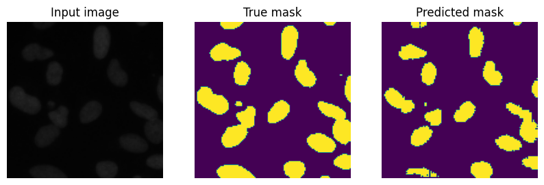

# 

# Applying Semantic Segmentation on Cell Neuclei using U-Net Architecture
An algorithm that can detect nuclei automatically in order to speed up research on a variety of diseases such as cancer, heart disease, and rare disorders. Such a tool has the potential to significantly accelerate the development of cures, benefiting those suffering from a variety of health conditions such as chronic obstructive pulmonary disease, Alzheimer's, diabetes, and even the common cold.

As a result, identifying cell nuclei is an important first step in many research studies because it allows researchers to analyze the DNA contained within the nucleus, which contains the genetic information that determines each cell's function. Researchers can examine how cells respond to different treatments and gain insights into the underlying biological processes at work by identifying cell nuclei. An automated AI model for identifying nuclei has the potential to streamline drug testing and shorten the time it takes for new drugs to reach the public.

With the advancement in AI technology, such a wondrous algorithm can actually be realize by utilizing the convolutional neural network in order to do a semantic segmentation on nuclei images. This project attempts to build a model that can successfully perform the segmentation accurately. The arhitecture that will be used in
this project is the U-Net architecture which was published in a [paper](https://arxiv.org/abs/1505.04597) by Olaf Ronneberger, Philipp Fischer and Thomas Brox in 2015.

## Steps Taken

### Step 1 - Data loading  

> The image dataset is obtained from [Booz Allen Hamilton](https://www.kaggle.com/competitions/data-science-bowl-2018/overview) at Kaggle. The path to the dataset is list into a variable using glob.
  
### Step 2 - Data cleaning and visualization  

> The input image and its mask of both the training and test dataset is loaded into the project using OpenCV. A few images from the train dataset are displayed to make sure that the images are loaded properly.

   
  Sample image of the data in the train dataset and its corresponding mask.

  

### Step 3 - Data preparation  

> The dataset is then normalized, with the images being normalized into a value betwen 0 and 1, and the masks being normalize into a value of 0 or 1. The train dataset is then split into a train and validation dataset. The train, validation and test dataset is then converted to tensors in preparation to be input into the model.

### Step 4 - Model development  

> MobileNetV2 is used as the base model for the downsampling layers of the U-Net architecture. The upsampling layer is acomplish by concatenating the output from the previous downsampling layer to decode the output that had been encoded in the downsampling layer.

   
  Accuracy changed during model training with the orange line as training and the blue line as validation.

 

> The model is trained for 20 epochs and the model is also made to do a prediction after it had finished training for each epoch. The prediction made can be observed in the GIF below.

   
  Prediction made by the model in each epoch.

 

### Step 5 - Model evaluation  

> The model is used to make prediction on a few unseen test images which is shown in the [Results](#results) section below. The model is also evaluated using the accuracy and the Intersection over Union (IoU) which can also be viewed in detailed in the [Results](#results) section below.

### Step 6 - Model saving

> The model is saved into an h5 file to be loaded for deployment.

## Results
The model managed to perform segmentation on the test image adequately. Even so, the model can be improved further by increasing its number of training epochs to around 50 and letting the Early Stopping judge when the model has stop improving.

 

   
  Prediction of the test image made by the model.

  

The model is then evaluated using accuracy and IoU as the metrics. The model scored 95% in accuracy and 0.68 in IoU.

 

   
  Metris for the evaluation made by the model.

  

## Usage Steps
> To run the python file, you need to download the dataset from [here](https://www.kaggle.com/competitions/data-science-bowl-2018/overview) and extract it into a new folder named dataset in the project path.   
> The path of the dataset folder should be **<PROJECT_PATH>/datasets/data-science-bowl-2018-2/**

## Model Architecture

 

   

  

## Acknowledgement
A huge thanks to [Booz Allen Hamilton](https://www.kaggle.com/competitions/data-science-bowl-2018/overview) from Kaggle for sharing the dataset used for this project!  
Thanks to the team who develop and publish the [MobileNetV2](https://arxiv.org/abs/1801.04381) model used in this project.  
A thousand thanks to the Olaf Ronneberger, Philipp Fischer and Thomas Brox for publishing the [U-Net architecture](https://arxiv.org/abs/1505.04597).
